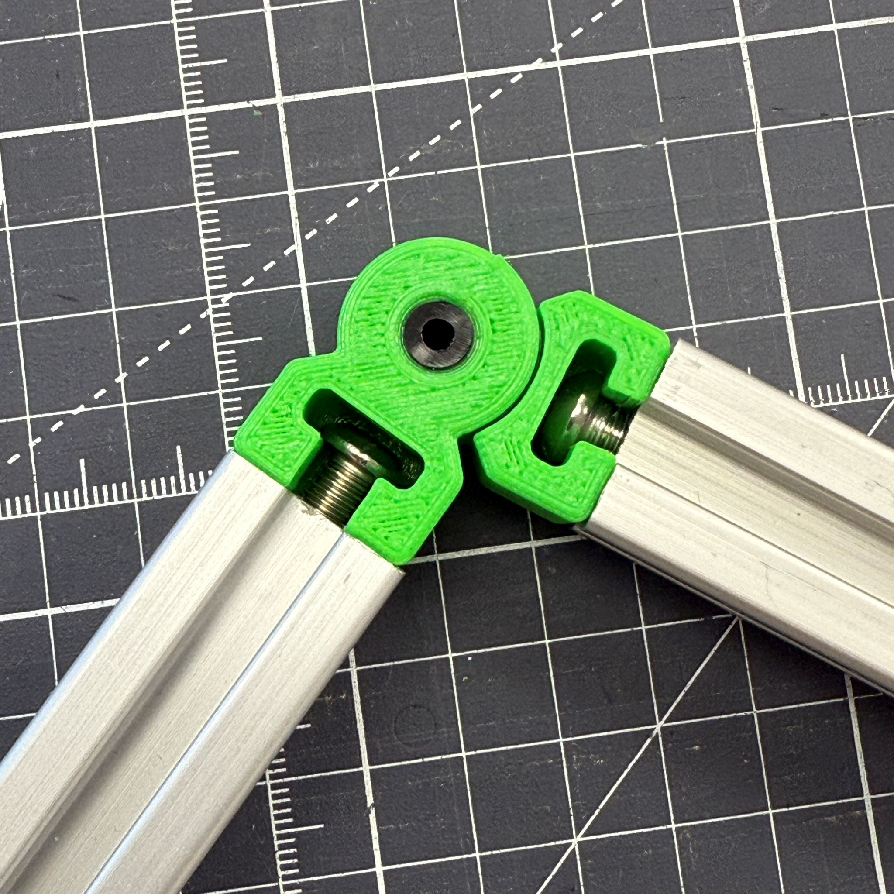
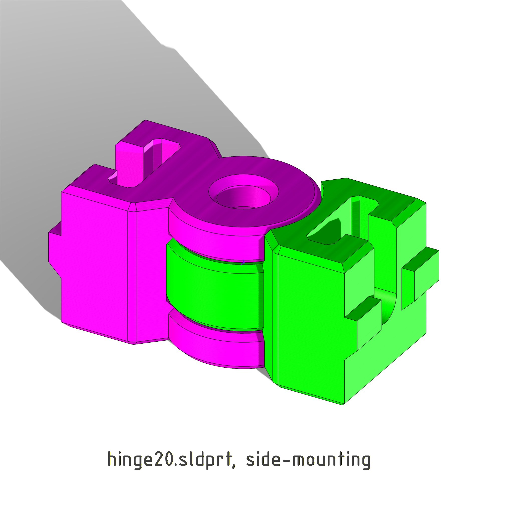

## Hinge for 2020 extrusion
A functional hinge for 20mm extrusions.  This is a side-mounted hinge with M5 or M6 fastener.  Sister model hingeEnd20 features end-mounted configuration.
- includes both hinge20 and hingeEnd20
- one model mounts to 2020 extrusion ends and one model mounts to sides. Combine options as desired.
- print-in-place with 2 bodies & snap apart to use.
- add a center pin size 6mm or 1/4in, LDPE tubing or stiffer
end-mounted hinge for 2020 extrusions. fairly parametric. mount with M6 screw. print-in-place and snap-apart. see openlab for more info

## Printing / Manufacturing Instructions
* **Material:** ABS
* **Supports:** None required
* **Tolerances:** N/A

## Source Code / Native CAD files
- `hinge20.SLDPRT` is the included SolidWorks source file.

## Alternate Views

