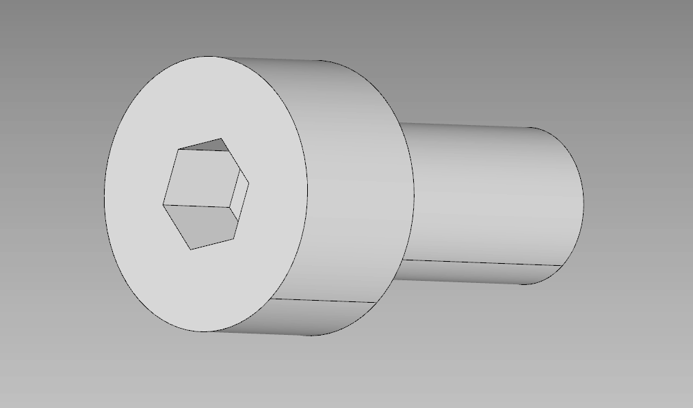

## Overview
Standard ISO 4762 (DIN 912) Hexagon socket head cap screws. This directory contains parametric source code to generate standard lengths, along with pre-compiled 10mm and 20mm variants.

## Parametric Generation
These screws were generated using a programmatic CAD pipeline. If you need a non-standard length, you can run the included Python script. 

### Manufacturing
* **Material:** Designed for standard A2 Stainless Steel.
* **Tolerances:** The threads are simplified for STEP export. If FDM printing is required, offset the thread faces by -0.15mm for proper engagement.

## Source Code
The included `generator.py` can be executed to create the STEP and STL:
```bash
python generator.py
```

## Alternate View

