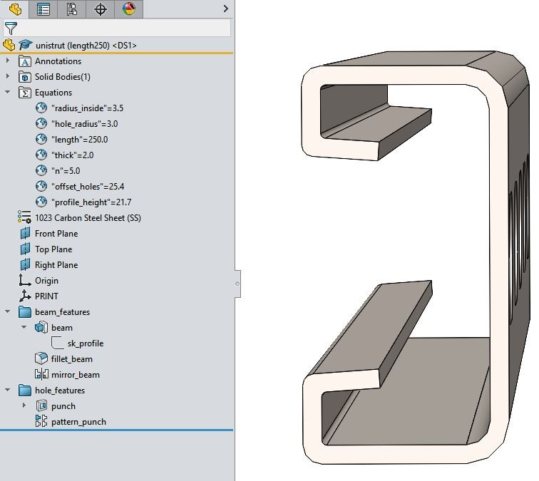

## Overview
This is a parametric strut channel commonly called unistrut. For the parametric function use the included SLDPRT file. Also included are some reference documentation and an example STL and STEP file.

## Material Information
* **Material:** Steel

## Source Files
* `unistrut.SLDPRT` is the included SolidWorks source file. 

## SolidWorks Tree View
